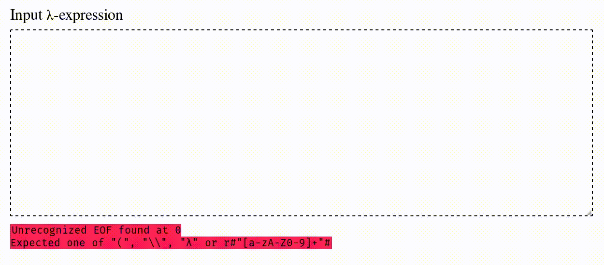

# λ-calculus Parser (using LALRPOP)

[](https://travis-ci.org/nixpulvis/lalrpop-lambda)
[](https://crates.io/crates/lalrpop-lambda)
[](https://docs.rs/lalrpop-lambda)

Write lambda calculus with ease, and evaluate it. There are a number of ways to
use this library (each interchangeable with another):

- `Expression` AST variants `Abs`, `App`, and `Var`
- Macros `abs!`/`λ!`, `app!`/`γ!`, and `var!`

    ```rust
    let id = λ!{x.x};
    let one = λ!{f.λ!{x.γ!(f,x)}};
    assert_eq!(1u64, u64::from(app!({id},{one})));
    ```

- Parsed λ-calculus strings

    ```rust
    let parser = ExpressionParser::new();
    parser.parse(r"\a b.a");
    parser.parse(r"\f x.(f (f x))");
    parser.parse(r"\\\x y z");
    ```

- Native types: `u64`, `bool`, `fn` (WIP)

    ```rust
    assert_eq!(λ!{f.λ!{x.γ!(f,γ!(f,x))}}, Expression::from(2u64));
    assert_eq!(true, bool::from(λ!{a.λ!{b.a}}));
    assert_eq!(1, λ!{x.x}(1));
    ```



### Usage (Rust)

```toml
[dependencies]
lalrpop_lambda = "*"
```

Read the [Rust documentation](https://docs.rs/lalrpop-lambda) for more
information.

### Usage (WASM/JS)

An `Exp` structure is provided through WASM for use in JS. This allows cross
platform, client-side, web based interfaces to be built for the λ-calculus.

Read the [WASM documentation][lalrpop_lambda-wasm] for more information.

### Development

This assumes you have an updated and working copy of [`rustup`][rustup].

```sh
cargo +nightly [build | test | bench | doc | run --example <>]
```

##### WASM

First make sure you have `wasm-pack` installed. Then:

```
wasm-pack build
```

[lalrpop_lambda-wasm]: https://docs.rs/lalrpop-lambda/latest/lalrpop_lambda/wasm/index.html
